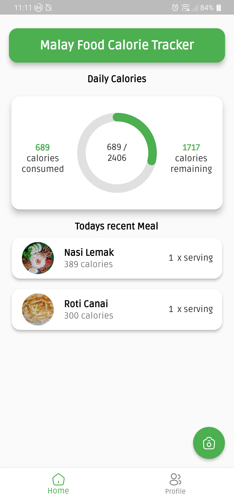
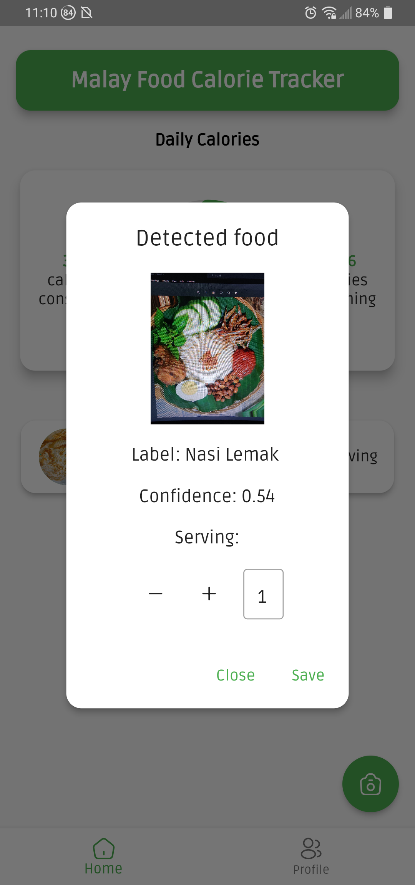
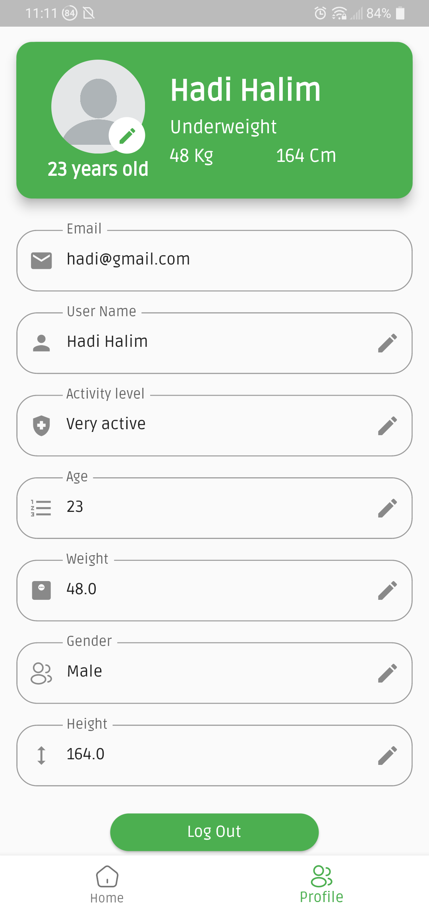

# Malay Food Calorie Tracker

## Project Overview
This project is a Malay Food Calorie Tracker application developed as a final year project. The app leverages computer vision and machine learning techniques to detect and classify various Malay foods and estimate their calorie content. The project aims to help users track their calorie intake based on specific Malay foods.

## Features
- **Food Detection and Classification**: Identifies and classifies popular Malay foods using image processing and machine learning models.
- **Calorie Estimation**: Provides an estimated calorie count for each recognized food item.
- **User-friendly Interface**: Designed using the Flutter framework for an intuitive and seamless user experience.

## Technology Stack
- **Flutter**: Frontend framework for building the mobile app interface.
- **TensorFlow**: Used for building and training the machine learning model.
- **Image Processing**: Techniques to preprocess food images before classification.

## Machine Learning Model
A ResNet-50 model was trained for food image classification, adapted to recognize common Malay food items. The model was implemented and integrated with the app to provide real-time food recognition and calorie estimates.

## Screenshots
Here are some screenshots of the Malay Food Calorie Tracker app:

<!-- 



 -->


## Getting Started
1. Clone the repository:
    ```bash
    git clone https://github.com/username/malay-food-calorie-tracker.git
    ```
2. Navigate to the project directory:
    ```bash
    cd malay-food-calorie-tracker
    ```
3. Install dependencies:
    - Ensure you have Flutter and TensorFlow installed.
    - Run `flutter pub get` in the project directory to install dependencies.

4. Run the app on an emulator or physical device:
    ```bash
    flutter run
    ```

## Usage
- **Capture** or **upload** an image of Malay food.
- The app will **identify** the food item and display the estimated **calorie count**.

## Project Structure
- **lib**: Contains the main Flutter application code.
- **assets**: Stores images and other static resources.
- **models**: Holds the trained machine learning model and related files.

## Future Enhancements
- Expand food database to include more Malay dishes.
- Improve calorie estimation accuracy by considering portion size.

## Acknowledgments
This project was developed as part of a final year project, aiming to showcase the application of machine learning in health and nutrition.

---
Feel free to contribute, raise issues, or suggest improvements!
